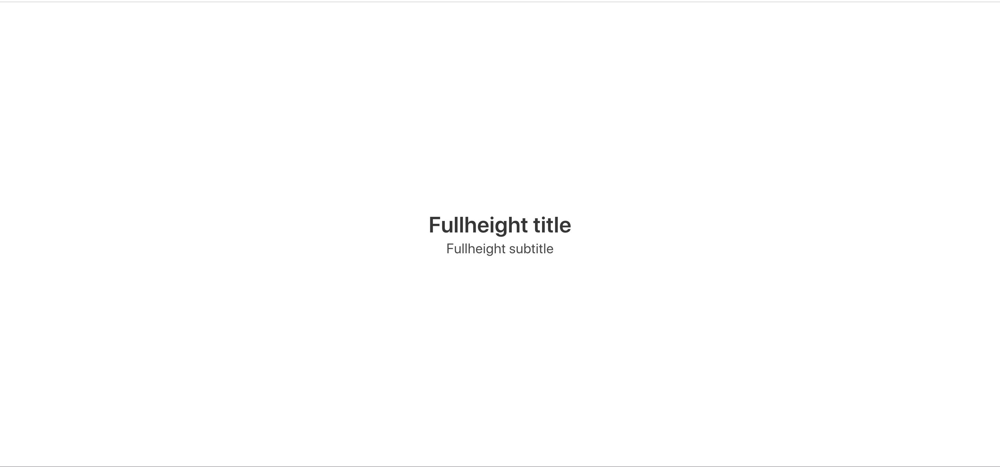
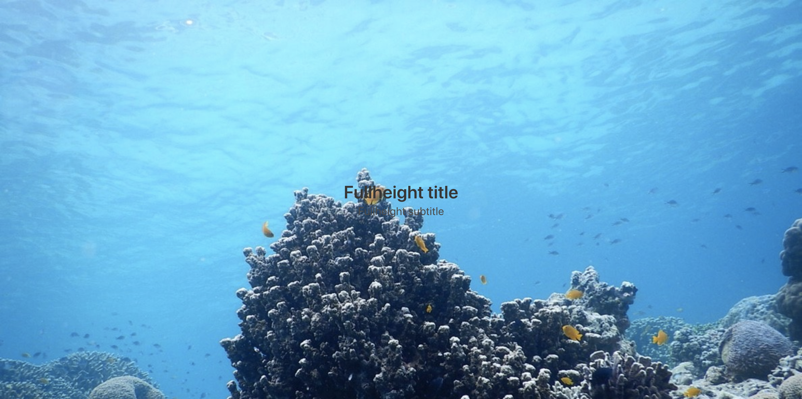
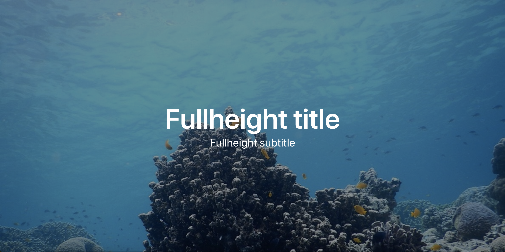

# {{ $page.title }}

<PostMeta/>

全画面表示の背景画像に、文字をのせる。  
インパクトのあるレイアウトだ。  
簡単におしゃれなサイトが作れると思い、このレイアウトでサイトをつくってみる。
ところが、いざ自分でつくってみるとあることに気づく。  
文字が読みづらいのだ...。  
背景画像の上の文字を読みやくするにはちょっとしたテクニックが必要だ。  
この記事ではAdobe IllustratorやPhotoshopを使わず、CSSだけで文字を読みやすくするテクニックを紹介する。


## 準備
まずは全画面に背景画像が表示されるようにし、テキストを画面の中央に配置する。  
全画面中央配置にはBulmaを使っている。  
BulmaをSCSSでカスタマイズする手順は下記の記事にまとめている。  

[BulmaをSCSSでカスタマイズできる環境をつくる](/how-to-customize-bluma-with-node-sass/)

### テキストを全画面中央配置する
index.html
```html
<!DOCTYPE html>
<html>
<head>
  <meta charset="utf-8">
  <meta name="viewport" content="width=device-width, initial-scale=1">
  <title>Fullscreen image</title>
  <link rel="stylesheet" href="css/style.css">
</head>
<body>
  <section class="hero is-fullheight has-text-centered">
    <div class="hero-body">
      <div class="container">
        <h1 class="title">
          Fullheight title
        </h1>
        <h2 class="subtitle">
          Fullheight subtitle
        </h2>
      </div>
    </div>
  </section>
</body>
</html>
```

style.scss
``` scss
@charset "utf-8";
@import "../node_modules/bulma/bulma.sass";
```

ディレクトリ構成
``` bash
├── css
│   └── style.css
├── img
│   └── bg.jpg
├── index.html
├── package-lock.json
├── package.json
└── scss
    └── style.scss
```

これで全画面の中央にテキストが表示される。



### 画像を全画面の背景にする
次に全画面の背景画像を設定していく。  
style.scssに`background-image`を指定することで背景画像を設定する。  
`width`、`height`を`100%`として画像の表示領域を画面全体とし、  
`background-size`を`cover`にすることで画像の縦横比を保持したまま表示領域いっぱいに背景画像が表示される。

``` scss
.hero--bg {
  background-image: url(../img/bg.jpg);
  background-size: cover;
  
  width: 100%;
  height: 100%;
}
```
準備はここまで。  
画像の上に文字を配置したが、文字が画像に埋もれて読みづらくなっている。  
これを読みやすくしていこいう。  



## 文字を大きくして、色を白にする
まずはこれを試す。  
タイトルの文字を大きくして、白にするだけで読みやすくなる。単純。簡単。  

``` html{4,7}
  <section class="hero is-fullheight has-text-centered hero--bg">
    <div class="hero-body">
      <div class="container container--hero">
        <h1 class="title title--hero">
          Fullheight title
        </h1>
        <h2 class="subtitle subtitle--hero">
          Fullheight subtitle
        </h2>
      </div>
    </div>
  </section>
```

``` scss
.title--hero {
  font-size: 5rem;
  color: #fff;
}

.subtitle--hero {
  font-size: 2rem;
  color: #fff;
}
```


## 背景全体を暗くする
背景を暗くすることで、より文字を読みやすくすることができる。
`before擬似要素`で背景画像の全面に要素を用意し、`rgba`で半透明の黒を重ねる。
``` scss
.hero--bg::before{
  content: "";
  position: absolute;
  top: 0;
  left: 0;
  display: block;
  width: 100%;
  height: 100%;
  background: rgba(0,0,0, 0.4);
}
```



背景を暗くしたので、文字の色が白以外でも大丈夫。

``` scss
.title--hero {
  font-size: 5rem;
  color: #00e3ff;
}
```


## 背景画像をぼかす
背景画像をぼかし、文字に焦点があいやすくすることで文字を読みやすくする。  
ぼかしにはfilterを使う。  
ただし、filterはIE11が対応してないので注意する。  
https://caniuse.com/#feat=css-filters

``` scss
.hero--bg {
  background-image: url(../img/bg.jpg);
  background-size: cover;
  
  width: 100%;
  height: 100%;

  position: relative;
  z-index: 0;
}

.hero--bg::before {
  content: '';
  position: absolute;
  z-index: -1;
  // blurで指定したpxと同じ値を指定する
  top: -10px;
  bottom: -10px;
  left: -10px;
  right: -10px;
  background: inherit;
  filter: blur(10px);
}
```


<br />
<br />

・参考サイト  
https://kuroeveryday.blogspot.com/2017/04/blur-effects-to-background.html
