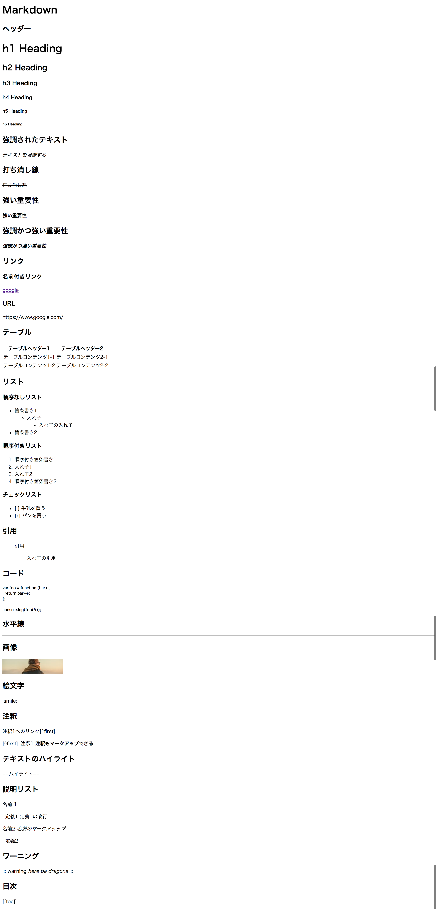

# {{ $page.title }}

<PostMeta/>

JavaScriptでMarkdownをHTMLに変換したいときには、`markdown-it`が使える。VuePressでも使われているので、そのデフォルトの挙動とプラグインをいれることで何ができるようになるのかを確認していく。

[[toc]]

## markdown-itとは
`markdown-it`はMarkdownパーサーだ。  
Markdown(マークダウン)は文書を記述するための記法の1つだ。ヘッダー、太字、箇条書きなどの書式を簡単に設定することができる。
そして、`markdown-it`はMarkdown記法で書かれた文字列をHTML形式に変換(パーサー)することができる。

## markdown-itインストール
それでは、さっそく`markdown-it`を試せる環境を作っていく。

``` sh
$ npm install markdown-it --save
```

package.json
``` sh
{
  "dependencies": {
    "markdown-it": "^8.4.2"
  }
}
```

ディレクトリ
``` sh
.
├── package-lock.json
├── package.json
└── test.md
```
## markdown-itでMarkdownをHTMLに変換する
`markdown-it`は基本的なMarkdown記法をHTMLに変換できる。ただし、オプションやプラグインがないと変換できないものもある。何も設定しない状態だと何ができて、何ができないのか調べてみる。  
まずは次の`test.md`を用意する。

test.md
``` md
# Markdown

## ヘッダー

# h1 Heading
## h2 Heading
### h3 Heading
#### h4 Heading
##### h5 Heading
###### h6 Heading

## 強調されたテキスト
_テキストを強調する_

## 打ち消し線
~~打ち消し線~~

## 強い重要性
__強い重要性__

## 強調かつ強い重要性
___強調かつ強い重要性___

## リンク
### 名前付きリンク
[google](https://www.google.com/)

## テーブル
テーブルヘッダー1  | テーブルヘッダー2
------------- | -------------
テーブルコンテンツ1-1  | テーブルコンテンツ2-1
テーブルコンテンツ1-2  | テーブルコンテンツ2-2

## リスト
### 順序なしリスト
* 箇条書き1
  * 入れ子
    * 入れ子の入れ子
* 箇条書き2

### 順序付きリスト
<!-- 順序付きリストは入れ子にならなそう -->
1. 順序付き箇条書き1
  1. 入れ子1
  2. 入れ子2
2. 順序付き箇条書き2

## 引用
> 引用
>> 入れ子の引用

## 画像


## 水平線
---

## URL
https://www.google.com/

## コード
<!-- 実際は半角スペース4つ不要 -->
    ``` js
    var foo = function (bar) {
      return bar++;
    };

    console.log(foo(5));
    ```

## 絵文字
:smile:

## 注釈
注釈1へのリンク[^first].

[^first]: 注釈1 **注釈もマークアップできる**

## テキストのハイライト
==ハイライト==

## チェックリスト
- [ ] 牛乳を買う
- [x] パンを買う

## 説明リスト
名前 1

:   定義1
定義1の改行

名前2 *名前のマークアッップ*

:   定義2

## ワーニング
::: warning
これは注意文言です
:::

## 目次
[[toc]]
```

コマンドラインでこのmdファイルをMarkdownからHTMLに変換する。
``` sh
// npx markdown-it [Markdown記法で書かれたファイル(xxx.md)] -o [出力するHTML]
npx markdown-it test.md -o test.html
```

ブラウザでの表示


ヘッダーやリスト、テキストの装飾、名前付きリンク、画像はHTMLに変換できている。  
また、テーブルや引用、コードはスタイルが当たっていないだけで以下のようにHTMLは変換できている。

test.html
``` html
<h2>テーブル</h2>
<table>
<thead>
<tr>
<th>テーブルヘッダー1</th>
<th>テーブルヘッダー2</th>
</tr>
</thead>
<tbody>
<tr>
<td>テーブルコンテンツ1-1</td>
<td>テーブルコンテンツ2-1</td>
</tr>
<tr>
<td>テーブルコンテンツ1-2</td>
<td>テーブルコンテンツ2-2</td>
</tr>
</tbody>
</table>

<h2>引用</h2>
<blockquote>
<p>引用</p>
<blockquote>
<p>入れ子の引用</p>
</blockquote>
</blockquote>

<h2>コード</h2>
<pre><code class="language-js">var foo = function (bar) {
  return bar++;
};

console.log(foo(5));
</code></pre>
```

一方で、URLの文字列が`<a>`タグにならなかったり、絵文字、注釈、テキストのハイライト、説明リストはHTMLに変換されない。これらは`markdown-it`のオプション、プラグインを使うことでHTMLに変換される。次は、このオプションやプラグインを見ていく。

## markdown-itをJavaScriptファイルから呼び出す
オプションやプラグインを使うためにJavaScriptファイルを用意する。  
まずは今まで通り、Markdown記法で書かれたファイルがHTMLに変換できるようにする。　　

なお`node`のバージョンは`10.15.2`を使っている。
``` sh
$ node -v
v10.15.2
```

index.js
``` js
const { promisify } = require('util');
const path = require('path');
const fs = require('fs');
const readFile = promisify(fs.readFile);
const writeFile = promisify(fs.writeFile);
const md = require('markdown-it')();

async function main(input, output) {
    try {
        const markdown = await readFile(input, 'utf-8');
        const html = md.render(markdown);
        await writeFile(output, html);
        console.info('file created successfully');
    } catch (e) {
        console.error('file error', e);
    } 
}

const args = process.argv.slice(2);
const input = path.resolve(__dirname, args[0]);
const output = path.resolve(__dirname, args[1]);
main(input, output);
```

`index.js`の1つ目の引数に入力のMarkdownファイル、2つ目の引数に出力するHTMLファイル名を指定する。`test.html`に今まで通りHTMLファイルが生成されていればOK。
``` sh
node index.js test.md test.html
```

## markdown-itのオプションでURLの文字列をリンクに変換する
URLの文字列をリンクに変換するには、オプションを指定するだけでよい。
`index.js`は変更のある部分だけ記載する。

index.js
``` js
const md = require('markdown-it')({
    linkify: true,
});
``` 

すると、このMarkdownが次のようなHTMLに変換される。  
Markdown
``` md
https://www.google.com/
```

HTML
``` html
<p><a href="https://www.google.com/">https://www.google.com/</a></p>
```

## markdown-it-emojiで絵文字を変換する
### 普通の絵文字に変換する
絵文字を扱うには[markdown-it-emoji](https://github.com/markdown-it/markdown-it-emoji)プラグインを使う。

``` sh
npm install markdown-it-emoji --save
```

``` json{4}
{
  "dependencies": {
    "markdown-it": "^8.4.2",
    "markdown-it-emoji": "^1.4.0"
  }
}
```

`markdown-it-emoji`をrequireして、`md.use`でプラグインを読み込む。  

index.js
``` js
const md = require('markdown-it')();
const emoji = require('markdown-it-emoji');
md.use(emoji);
```

`<3`のような[ショートカット](https://github.com/markdown-it/markdown-it-emoji/blob/master/lib/data/shortcuts.js)も絵文字に変換される。`<3`はおならではなくハートらしい。

Markdown
``` md
:smile:
<3
```

HTML
``` html
<p>😄
❤️</p>
```

### twemojiでTwitterの絵文字に変換する
さらに、Twitterの絵文字ライブラリ[twemoji](https://github.com/twitter/twemoji)を入れると絵文字の表記を変えることができる。`md.renderer`により出力したときの見た目を変更する。

``` sh
npm install twemoji --save
```

package.json
``` json{5}
{
  "dependencies": {
    "markdown-it": "^8.4.2",
    "markdown-it-emoji": "^1.4.0",
    "twemoji": "^11.3.0"
  }
}
```

index.js
``` js
const md = require('markdown-it')();
const emoji = require('markdown-it-emoji');
const twemoji = require('twemoji')

md.use(emoji);
md.renderer.rules.emoji = function (token, idx) {
    return twemoji.parse(token[idx].content);
};
```

test.md
``` md
:smile:
<3
```

test.html
``` html
<p>
</p>
```

ブラウザでの表示  


## markdown-it-footnoteで注釈を変換する
本文中の語句や文章の意味を解説するために注釈をつけることができる。
注釈を扱うには[markdown-it-footnote](https://github.com/markdown-it/markdown-it-footnote)プラグインを使う。

`markdown-it-footnote`をインストールし、`use`で読み込む。

``` sh
npm install markdown-it-footnote --save
```

package.json
``` json{5}
{
  "dependencies": {
    "markdown-it": "^8.4.2",
    "markdown-it-emoji": "^1.4.0",
    "markdown-it-footnote": "^3.0.1",
    "twemoji": "^11.3.0"
  }
}
```

index.js
``` js
const footnote = require('markdown-it-footnote');
md.use(footnote);
```

注釈へのリンクは`[^注釈への目印]`として、注釈には`[^注釈への目印]: 説明`(`:`が必要)とする。注釈は複数行書くことができる。注釈への目印はHTMLに変換される際に連番のリンクになり、注釈への目印で指定した文言になるわけではない。  
また、`^[説明]`のような書き方をすることでインラインで説明を書くことができる。  
  
test.md
``` md
## 注釈
注釈1へのリンク[^first].
複数行の注釈へのリンク[^hoge]

[^first]注釈1 **注釈もマークアップできる**
[^hoge]: これは複数行の注釈です。  
これは2行目の注釈を表示しています。

インライン注釈^[この書き方であれば、Markdownを書くときに注釈へのリンクと、注釈を近くに書くことができる]
```

注釈はMarkdownで書いた位置に表示されるのではなく、一番下に水平線が引かれ、その下に表示される。  

ブラウザでの表示  


## markdown-it-markでテキストのハイライトを変換する
テキストのハイライトには[markdown-it-mark](https://github.com/markdown-it/markdown-it-mark)プラグインを使う。

``` sh
npm install markdown-it-mark --save
```

package.json
``` json{6}
{
  "dependencies": {
    "markdown-it": "^8.4.2",
    "markdown-it-emoji": "^1.4.0",
    "markdown-it-footnote": "^3.0.1",
    "markdown-it-mark": "^2.0.0",
    "twemoji": "^11.3.0"
  }
}
```

index.js
```
const mark = require('markdown-it-mark');
md.use(mark);
```

ハイライトしたい文字の前後を`==`で囲む。出力されるHTMLでは`mark`タグで囲まれて出力される。

test.md
``` md
==ハイライト==
```

ブラウザでの表示  


## markdown-it-deflistで説明リストを変換する
説明リスト(`<dl>`)は特に設定なくMarkdownからHTMLに変換できそうだが、[markdown-it-deflist](https://github.com/markdown-it/markdown-it-deflist)プラグインがないと変換できない。

``` sh
npm install markdown-it-deflist --save
```

package.json
``` json{4}
{
  "dependencies": {
    "markdown-it": "^8.4.2",
    "markdown-it-deflist": "^2.0.3",
    "markdown-it-emoji": "^1.4.0",
    "markdown-it-footnote": "^3.0.1",
    "markdown-it-mark": "^2.0.0",
    "twemoji": "^11.3.0"
  }
}
```

index.js
``` js
const deflist = require('markdown-it-deflist');
md.use(deflist);
```

説明リストの用語を1行で書き、その下に`: [説明]`(`:`の後ろに1つ以上の半角スペース)に説明を書く。説明と次の用語の間は1行以上あける。

test.md
``` md
名前 1
:  定義1
定義1の改行

名前2 *名前のマークアッップ*

:  定義2
```

ブラウザでの表示  


<!-- ## markdown-it-containerでワーニング表示を変換する
ワーニング表示などで使われる文字をブロックで囲んで表示するには[markdown-it-container](https://github.com/markdown-it/markdown-it-container)プラグインを使う。

``` sh
npm install markdown-it-container --save
```

package.json
``` json{4}
{
  "dependencies": {
    "markdown-it": "^8.4.2",
    "markdown-it-container": "^2.0.0",
    "markdown-it-deflist": "^2.0.3",
    "markdown-it-emoji": "^1.4.0",
    "markdown-it-footnote": "^3.0.1",
    "markdown-it-mark": "^2.0.0",
    "twemoji": "^11.3.0"
  }
}
``` -->
<!-- ## markdown-it-で目次を変換する -->
<!-- ## markdown-it-でコードのハイライトにスタイルを当てる -->
<!-- ## markdown-it-katexで数式エディタ -->
<!-- ## markdown-itで独自のカスタマイズをする -->

## まとめ
- `markdown-it`のみだと、ヘッダーやリスト、テキストの装飾、名前付きリンク、画像、テーブル、引用、コードをMarkdownからHTMLへ変換することができる。
- URLの文字列を自動でリンクにするにはオプションを有効にするだけでよい。
- 絵文字、注釈、テキストのハイライト、説明リストをMarkdownからHTMLへ変換するには、プラグインを使う必要がある。

・参考  
https://github.com/markdown-it/markdown-it
https://github.com/markdown/markdown.github.com/wiki/Implementations
